# Look-Alike Architecture Diagram (Mermaid)

This diagram shows the integrated architecture for look-alike generation using specialized tools (6sense/ZoomInfo/D&B) + Apollo enrichment.

## How to Generate Image

### Option 1: GitHub (easiest)
- Commit this file to GitHub
- GitHub will automatically render the Mermaid diagram
- Right-click → "Save image as"

### Option 2: VS Code
- Install "Markdown Preview Mermaid Support" extension
- Preview this file
- Take screenshot

### Option 3: Mermaid Live Editor
- Go to: https://mermaid.live
- Copy the code below and paste it
- Export as PNG/SVG

---

## Architecture Flow Diagram

```mermaid
flowchart TD
    Start([ERP Data: Top 20% Customers]) --> ICP[Step 1: ICP Extraction<br/>Strikezone Backend<br/>- Industries<br/>- Geography<br/>- Size ranges<br/>- Behavioral patterns]
    
    ICP --> ICPJson{ICP Profile<br/>JSON}
    
    ICPJson --> ToolAPI[Step 2: Look-Alike Generation<br/>Specialized Tool API<br/>🎯 6sense OR<br/>🔍 ZoomInfo OR<br/>📊 D&B Lattice]
    
    ToolAPI --> ToolResponse{Scored<br/>Account List}
    
    ToolResponse --> DB[Step 3: Store Targets<br/>lookalike_targets table<br/>- status: pending_review<br/>- similarity_score<br/>- reason_codes<br/>- source: tool name]
    
    DB --> Portal[Step 4: Approval Portal<br/>React Frontend<br/>👤 Human Review<br/>✅ Approve / ❌ Reject / ✏️ Edit]
    
    Portal --> Approved{Approved<br/>Accounts?}
    
    Approved -->|Yes| Apollo[Step 5: Contact Enrichment<br/>Apollo.io API<br/>- Find decision-makers<br/>- Job titles<br/>- Email + LinkedIn]
    
    Approved -->|No| Rejected[Rejected:<br/>Do not proceed]
    
    Apollo --> Enriched{Enriched<br/>Contacts}
    
    Enriched --> Export[Step 6: Ready for Outreach<br/>Export to CRM or<br/>Sales Engagement Platform]
    
    Export --> End([Outbound Campaign])
    
    style Start fill:#e1f5ff
    style ICP fill:#fff3cd
    style ToolAPI fill:#d4edda
    style Portal fill:#f8d7da
    style Apollo fill:#d1ecf1
    style Export fill:#d4edda
    style End fill:#e1f5ff
    
    style Approved fill:#fff3cd
    style ICPJson fill:#e2e3e5
    style ToolResponse fill:#e2e3e5
    style Enriched fill:#e2e3e5
```



---

## Vertical Architecture (Alternative View)


---

## Data Flow (Detailed)


---

## Component Architecture


---

## To Generate PNG/SVG:

### Using Mermaid CLI (recommended)
```bash
# Install mermaid-cli
npm install -g @mermaid-js/mermaid-cli

# Generate PNG
mmdc -i LookAlike_Architecture_Diagram.md -o LookAlike_Architecture.png -t forest

# Generate SVG (better quality)
mmdc -i LookAlike_Architecture_Diagram.md -o LookAlike_Architecture.svg
```

### Using Online Tool
1. Go to https://mermaid.live
2. Copy one of the diagrams above
3. Click "Actions" → "PNG" or "SVG"
4. Download the image
